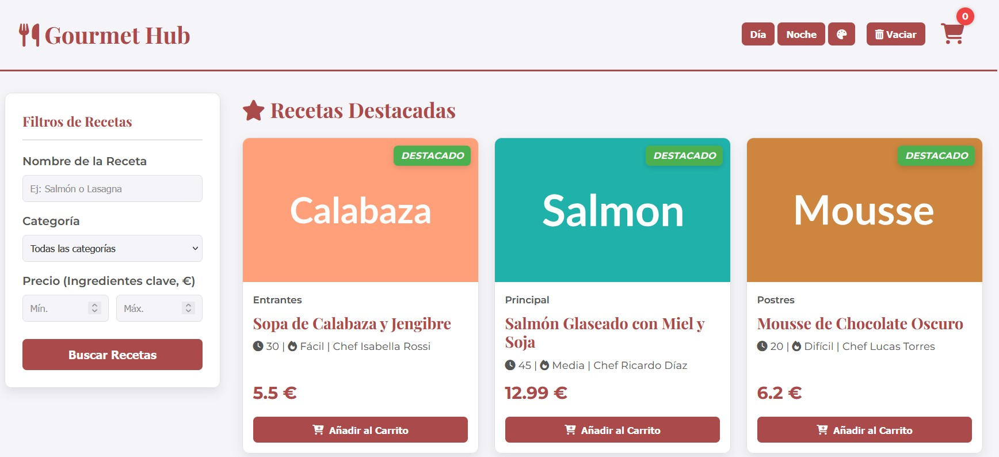

# 🍽️ Gourmet Hub

**Gourmet Hub** es una aplicación web de recetas gastronómicas desarrollada con **HTML, CSS y JavaScript puro**, donde puedes explorar recetas destacadas, filtrar por nombre, categoría o precio, y añadir platos a un carrito de compra interactivo.

---

## 🖼️ Vista previa

🌐 **Demo en vivo:**  
[👉 Ver proyecto en Netlify](https://app.netlify.com/projects/gourmet-hub-landing-page/overview)

## 🚀 Funcionalidades principales

- ✅ **Visualización dinámica de recetas**

  - Las tarjetas de recetas se generan con JavaScript a partir de un array de objetos (`recetas`).
  - Cada receta muestra nombre, categoría, tiempo, dificultad, chef y precio.

- 🔍 **Filtros de búsqueda**

  - Permite filtrar recetas por nombre, categoría o rango de precio.
  - Los resultados se muestran en una nueva sección creada dinámicamente.

- ⭐ **Sección de recetas destacadas**

  - Filtra y muestra recetas marcadas con `esDestacado: true`.

- 🛒 **Carrito de compra interactivo**

  - Añade platos al carrito desde las tarjetas.
  - Incrementa cantidades si se añaden varias veces.
  - Calcula automáticamente **subtotal, IVA (10%) y total**.
  - Permite **vaciar el carrito** con un solo clic.
  - Contador visible en el icono del carrito.

- 🎨 **Temas personalizables**
  - Modo día 🌞 / noche 🌙 con un solo clic.
  - Botón de **color aleatorio** que cambia el color principal del tema (`--color-principal`).

---

## 🧱 Tecnologías utilizadas

- **HTML5** – estructura y secciones dinámicas
- **CSS** – estilos responsivos y variables de tema
- **JavaScript (ES6+)** – manipulación del DOM, eventos, filtros y carrito

---

🧩 Próximas mejoras (ideas)

Agregar persistencia del carrito con localStorage.

Implementar ordenamiento por precio o tiempo de preparación.

Añadir un formulario de contacto o reseñas.

Conectar con una API real de recetas (por ejemplo, TheMealDB).

✨ Autor

Proyecto desarrollado por LAURA MONTIRONI como práctica de desarrollo frontend en JavaScript.
📅 Fecha: NOV-2025
